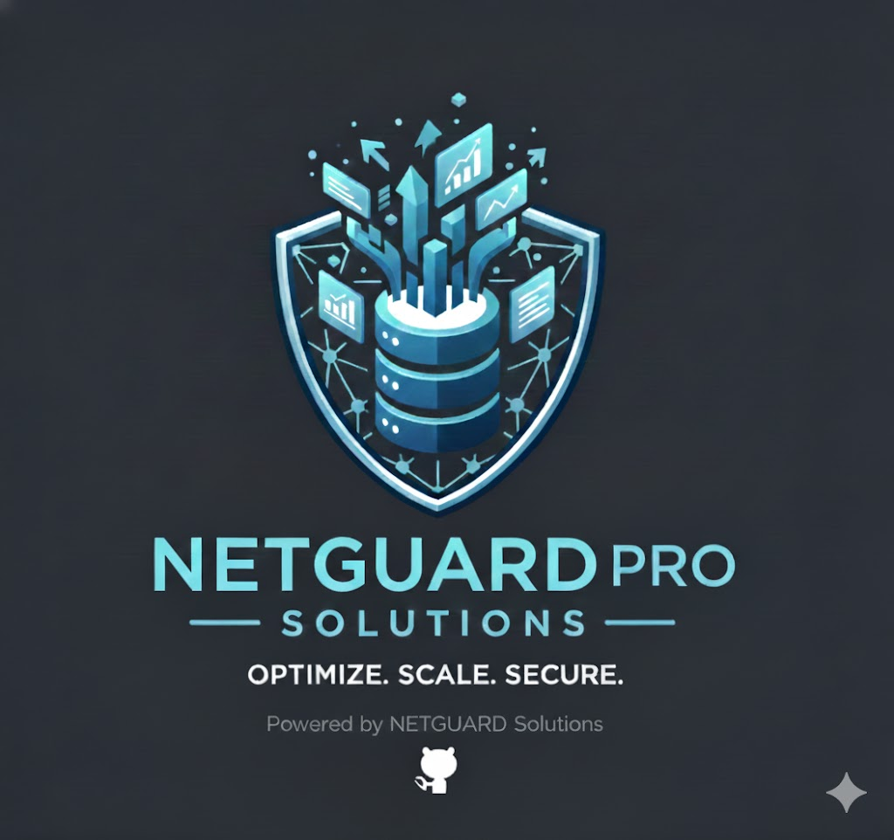

<h1 align="center">NetGuard Pro</h1>

  
  
  
  
  

---

## 📚 Quick Access

- [Introduction](#-introduction-)
- [Key Features](#-key-features-)
- [Compatible Integrations](#-compatible-integrations-)
- [System Requirements](#-system-requirements-)
- [Getting Started](#-getting-started-with-netguard-pro-)
- [Licensing & Pricing](#-licensing--pricing-)
- [Technical Architecture](#technical-architecture-)
- [Contributing](#contributing-)
- [Quick Glossary](#quick-glossary-)
- [Contact & Support](#-contact--support-)

## 🚀 Introduction 

**NetGuard Pro** is an advanced solution for network performance optimization, enterprise-grade security, and seamless scalability.  
Developed by **NetGuard Solutions**, it is designed to serve both small and medium-sized businesses as well as Fortune 500 companies with complex infrastructure needs.

NetGuard Pro combines real-time monitoring, intelligent automation, and modern control tools to ensure networks operate efficiently, securely, and with future-proof scalability.

---

## ✨ Key Features 

### 🔧 Network Optimization  
- Automated traffic monitoring  
- Bottleneck and congestion detection  
- Dynamic bandwidth allocation  
- Continuous performance analysis  

### 🔐 Enhanced Security  
- Integrated firewall with customizable rules  
- Real-time threat detection  
- Event-driven smart alerts  
- TLS 1.3 encrypted communication  

### 📈 Seamless Scalability  
- Suitable for small setups and enterprise environments  
- Native integration with AWS, Azure, and Google Cloud  
- Automated load balancing  
- Cluster-ready distributed architecture  

### 🖥 User-Friendly Interface  
- Real-time intuitive dashboard  
- Customizable widgets and views  
- Configurable notifications  
- Built-in API for automation and workflows  

---

## 🔌 Compatible Integrations 

### Cloud Providers  
- AWS  
- Microsoft Azure  
- Google Cloud Platform  

### Third-Party Tools  
- Slack (instant notifications)  
- PagerDuty (incident management)  
- Splunk (advanced monitoring & analytics)  

---

## ⚙️ System Requirements 

### Operating Systems  
- Windows Server 2016/2019  
- Linux (Ubuntu 20.04+, CentOS 7+)  
- macOS 10.15+  

### Hardware  
- **CPU:** 4 cores (min.), 8 cores recommended  
- **RAM:** 8 GB (min.), 16 GB recommended  
- **Storage:** 500 GB (min.), 1 TB SSD recommended  
- **Network:** 1 Gbps (min.), 10 Gbps for enterprise deployments  

---

## 📥 Getting Started with NetGuard Pro 

### 1️⃣ Download & Install  
- Visit the official website → *Downloads*  
- Select the installer for your OS  
- Run the installer and follow the setup steps  

### 2️⃣ Initial Configuration  
- Launch NetGuard Pro  
- Use the setup wizard  
- Create secure admin credentials  
- (Optional) Import settings from `.json` or `.yaml`  

### 3️⃣ License Activation  
- Enter your license key  
- Or start the **30-day free trial**  
- For volume licenses, specify the number of servers  

### 4️⃣ Network Integration  
- Automatic device discovery  
- Optimization recommendations based on your topology  
- Apply or adjust suggested configurations  

### 5️⃣ Dashboard Overview  
- Real-time traffic visibility  
- Security alerts  
- Performance analytics  
- Customizable widgets and role-based views  

---

## 💼 Licensing & Pricing 

### Subscription Model  
- Monthly or annual billing  
- Pricing based on server count  
- Volume discounts available  

### Plans  
- **Small Teams:** $499/month (up to 5 servers)  
- **Medium Organizations:** $1,299/month (up to 15 servers)  
- **Enterprise:** Custom pricing  

---

## Technical Architecture 

NetGuard Pro is built on a distributed, modular architecture designed for performance, security, and enterprise scalability. Each component operates independently while communicating securely to maintain real-time visibility and consistent system behavior.

### Core Components

**Monitoring Engine**  
Captures and analyzes network traffic across layers 2 through 7. Identifies anomalies, unusual behavior, performance issues, and unauthorized activities.

**Policy Engine**  
Executes dynamic rules defined by administrators. Policies apply to devices, applications, user groups, or network segments, with real-time impact analysis before deployment.

**Event Correlation System**  
Aggregates and correlates events to identify patterns, security incidents, and performance risks that would not be visible individually.

**Alerting Layer**  
Issues prioritized alerts with integrations for Slack, PagerDuty, SIEM platforms, and custom webhooks. Alerts follow severity-based classification.

**Load Balancing & Optimization Layer**  
Distributes workload across nodes and services, reducing latency, improving throughput, and preventing congestion using predictive analytics.

**Distributed Node Architecture**  
Local agents capture traffic and perform pre-processing. Communication between nodes and the controller is secured with TLS 1.3.

**Cloud Integration Layer**  
Provides native connectors for AWS, Azure, and Google Cloud, enabling hybrid and multi-cloud deployments.

### How the System Works Internally

1. Distributed nodes capture and preprocess traffic.  
2. Data is normalized and sent to the monitoring engine.  
3. The event correlation system identifies patterns.  
4. Policies dynamically adapt based on context.  
5. Events and alerts flow into the dashboard or external tools.  
6. Optimization modules rebalance loads and adjust traffic paths.
---

## Real-World Use Case 

**Client Profile:**  
A mid-sized financial services company operating across three regional offices and a cloud-based data center. The company manages sensitive customer data, high-volume transaction processing, and strict regulatory compliance requirements.

### Problem
The organization experienced significant issues with network congestion during peak transaction hours, inconsistent visibility across on-premise and cloud workloads, and an increasing number of security alerts that required manual triage.  
Their existing monitoring tools provided limited correlation capabilities, resulting in delayed incident response and operational inefficiency.

### Solution with NetGuard Pro
NetGuard Pro was deployed in a hybrid architecture across local servers and their cloud infrastructure. Key actions included:

- Activating the **Monitoring Engine** on internal segments and critical workloads.  
- Applying **dynamic policies** to prioritize transactional traffic and restrict non-essential services during peak hours.  
- Using the **Event Correlation System** to unify alerts coming from on-premise systems and cloud workloads.  
- Enabling **load balancing** for high-demand transactional APIs.  
- Integrating alerts with the client's SIEM using webhooks for consolidated analysis.

### Results
After a four-week deployment and tuning phase:

- Network congestion during peak hours decreased by **38%**.  
- Incident response time improved by **55%** due to correlated alerts.  
- Latency in transaction processing was reduced by **22%**.  
- Compliance reporting improved with centralized audit logs and consistent policy enforcement.  
- The company avoided a projected **$120,000 annual cost** associated with downtime and manual incident triage.

This case demonstrates how NetGuard Pro strengthens security, enhances operational efficiency, and optimizes performance in environments where stability and compliance are mission-critical.

---

## Contributing 

We welcome contributions from developers, network engineers, and cybersecurity specialists who want to improve NetGuard Pro.

### How to Contribute

1. Fork this repository.  
2. Create a feature branch:  
   `git checkout -b feature/your-feature-name`  
3. Use meaningful commit messages following conventional commits.  
4. Push the branch and open a Pull Request.  
5. Add documentation or examples for new features.  
6. Maintain compatibility with existing architecture and security requirements.

### Contribution Guidelines

- Ensure code is clean, modular, and well-structured.  
- Avoid breaking changes unless discussed in an Issue.  
- Include tests or reproducible examples when possible.  
- Follow directory and naming conventions.  
- Coordinate major changes through Issues before implementation.

All contributions are reviewed by the maintainers to ensure quality, security, and alignment with the project roadmap.

## 📘 Quick Glossary 

- **Event:** A recorded activity detected on the network  
- **Policy:** A set of rules applied for security or performance control  
- **Correlation:** Combining multiple events to detect meaningful patterns  
- **MFA:** Multi-Factor Authentication  
- **RBAC:** Role-Based Access Control  

---

## 🧭 Contact & Support 

- 🌐 Website: www.netguardsolutions.com  
- ✉️ Email: info@netguardsolutions.com  
- 📞 Phone: +1-800-555-1234  
- 💼 LinkedIn: *NetGuard Solutions*  

---

*This company and all information provided are fictional and created exclusively for educational purposes.*  
© 2024 Generation: You Employed, Inc.
